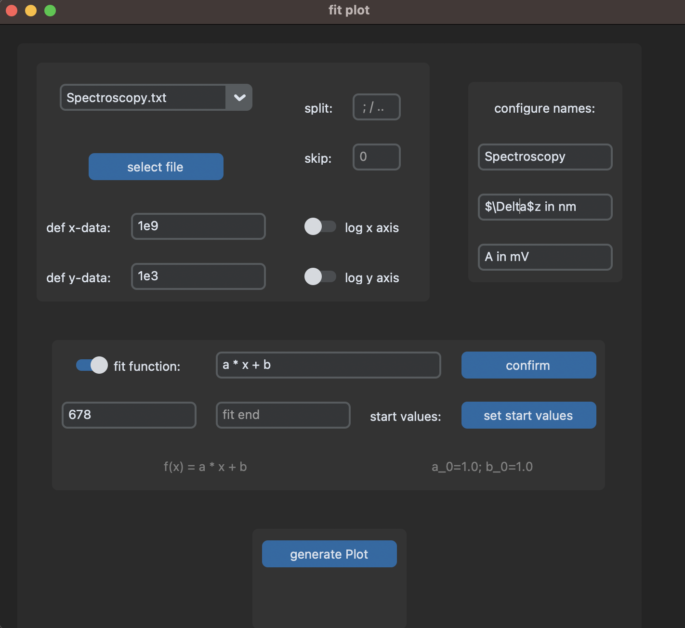

Hello fellow student, welcome to my SuperFitPlotter!

This is an App with all the important Features you need to create pretty plots A12BF-PrAkTiKuM

Features Include (that are not obvious):
- mark Points with simple Mouse click / delete mark with right click
- dragg marks and legend to desired place with the mouse
- Extract x and y data dynamically by writing a function of the columns
- If the fit doesn't work immediately, adjust start values for fit parameters

Here a beautiful example:
<!--suppress CheckImageSize -->
 

If you have improvement ideas for plot visuals, let me know!

install required modules with "pip install -r requirements.txt" and run main.py

Have fun!!
